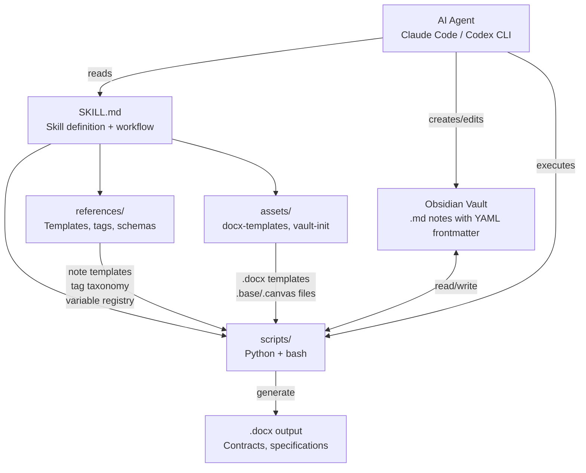
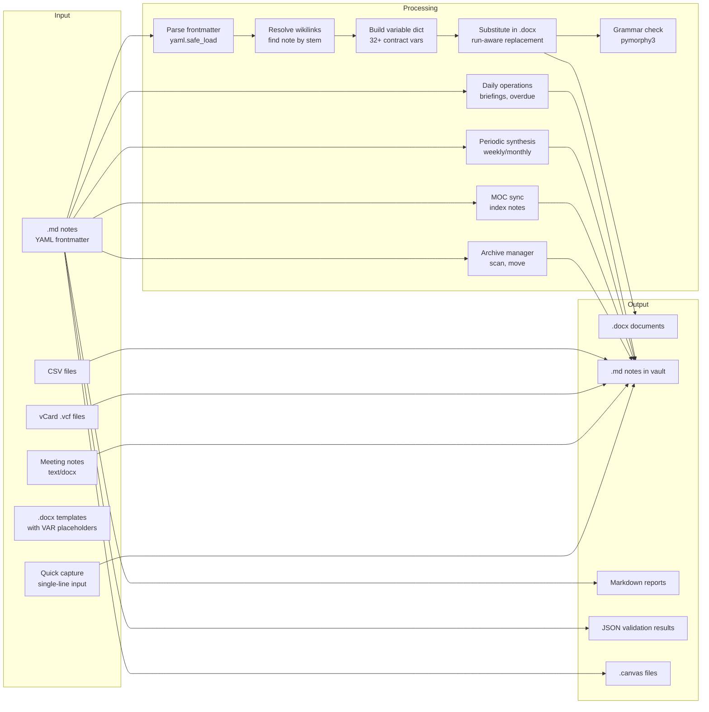

# Architecture

## System overview

## Data flow

## Layers

### Presentation layer (Obsidian)

The end-user interacts with data through Obsidian:

- **Notes** (.md) -- structured Markdown files with YAML frontmatter containing typed properties
- **Dashboards** (.base) -- YAML-defined views with filters, formulas, grouping, and summaries
- **Canvases** (.canvas) -- JSON Canvas visual maps showing relationships between notes
- **Wikilinks** -- `[[bidirectional links]]` connecting related entities across the vault

### Logic layer (Python scripts)

19 scripts handle all data processing:

- **Document generation** -- `generate_contract.py`, `generate_specification.py` read vault data and fill .docx templates
- **Grammar checking** -- `grammar_check.py` validates Russian genitive case in legal documents
- **Data import** -- `import_csv.py`, `import_vcard.py`, `import_meeting.py` create notes from external sources
- **Quick capture** -- `quick_capture.py` creates notes from single-line descriptions
- **Validation** -- `validate_vault.py` enforces schema, `audit_links.py` checks link integrity
- **Synchronization** -- `relationship_sync.py` maintains bidirectional links, `bulk_status_update.py` handles mass operations, `sync_moc.py` keeps MOC index notes in sync with vault content
- **Reporting** -- `generate_report.py` produces Markdown reports from vault data
- **Financial module** -- tracks payments, invoices, and budgets
- **Calendar operations** -- `daily_operations.py` creates daily notes, morning briefings, and overdue checks
- **Periodic synthesis** -- `periodic_synthesis.py` generates weekly/monthly retrospectives
- **Canvas generation** -- `generate_canvas.py` creates .canvas files from vault data
- **Archive management** -- `archive_manager.py` scans for archive candidates and moves completed items
- **Initialization** -- `init_vault.sh` sets up vault structure

### Data layer (YAML frontmatter)

All structured data lives in YAML frontmatter of .md files:

- **Type system** -- every note has a `type` field (one of 15 types)
- **Tag taxonomy** -- hierarchical tags with prefixes: `тип/`, `статус/`, `приоритет/`, `направление/`, `связь/`
- **Entity references** -- `[[wikilinks]]` in YAML properties create typed relationships
- **Contract variables** -- `_рп` suffix fields store genitive case forms for .docx generation

## Component descriptions

### SKILL.md

The skill definition file following the Agent Skills specification. Contains:
- YAML frontmatter with metadata (name, version, license, compatibility)
- Workflow instructions for the AI agent
- Note type table mapping types to folders and templates
- References to all supporting documents

### references/

10 reference documents providing schemas, templates, and specifications:
- `TEMPLATES.md`, `TEMPLATES_CONTACTS.md` -- note templates for all 15 types
- `BASES.md` -- 9 dashboard definitions in `.base` YAML format
- `CANVAS.md` -- 4 canvas templates in JSON Canvas format
- `TAGS.md` -- full tag taxonomy
- `RELATIONSHIPS.md` -- bidirectional relationship types and mirror pairs
- `VAULT_STRUCTURE.md` -- 15-folder structure specification
- `CONTRACT_VARS.md` -- 37 variable definitions for .docx generation

### scripts/

All executable logic (19 scripts). Python scripts use `argparse` for CLI, output JSON or Markdown, and operate on vault paths. The bash script `init_vault.sh` handles initial folder creation and file copying. Includes modules for financial tracking, meeting import, quick capture, daily operations, periodic synthesis, MOC synchronization, canvas generation, and archive management.

### assets/

Static resources:
- `docx-templates/` -- Word document templates with `{{VAR|ID|default}}` placeholders
- `vault-init/` -- `.base` and `.canvas` files copied during vault initialization
